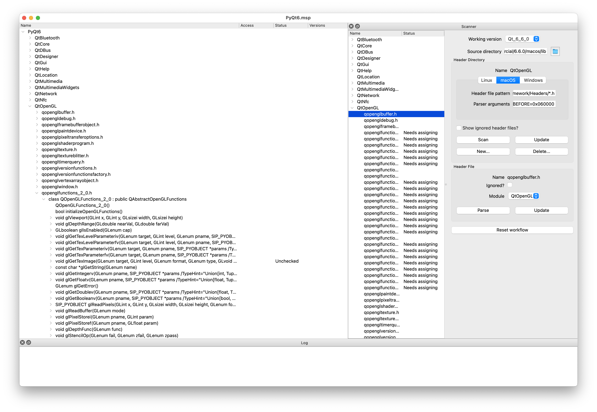

# `msip` GUI Tool

`msip` is the GUI part of MetaSIP that allows the bindings developer to create
a project that contains the history of the API of one or more libraries.

To install `msip`, run the following command:

    pip install metasip[gui]

The image below shows the GUI with the project for
[PyQt6](https://pypi.org/project/PyQt6/) opened.

The image shows the three main areas of the GUI:

- the main area shows the complete API as a tree structure with the top level
  Python package as it's root
- the area on the right side (the `Scanner`) shows a number of header
  directories containing the individual header files that define the libraries
  APIs
- the area at the bottom shows various error and progress messages that may be
  issued by the scanner.

## Workflow

The workflow to create a set of bindings can be summarised as:

- specify the name of the root package (if multiple modules are going to be
  created)
- specify the individual Python modules to be created (typically one for each
  library)
- specify the directories containing the header files than define the APIs of
  each library (a well designed library will typically have its own header
  directory)
- scan each header directory so that each header file appears in the `Scanner`
  and marked as `Needs assigning`
- assign each header file to one of the Python modules or mark it as `Ignored`
- parse each assigned header file so that it appears under the module in the
  main part of the GUI and contains each API item defined in the header file
- review each API item marked as `Unchecked`, specifying any required SIP
  annotations, directives or handwritten code, and updating the status to
  `Checked`, `Ignored` or `Todo` as appropriate.
  
When a new release of the libraries is made then a corresponding new version is
defined in `msip`, the workflow reset, and the above workflow is repeated.
`msip` will only change the status of an existing API item to `Unchecked` if
the item has changed in some way since the previous release.  This dramatically
reduces the amount of work that the developer needs to do when a new release is
made.

When a project is opened then the tree in the main part of the GUI is only
expanded to show API items that are not `Checked` to make it easy for the
developer to identify the tasks that are still outstanding at any time.

Use `msipgen` to generate the `.sip` files from the project.
